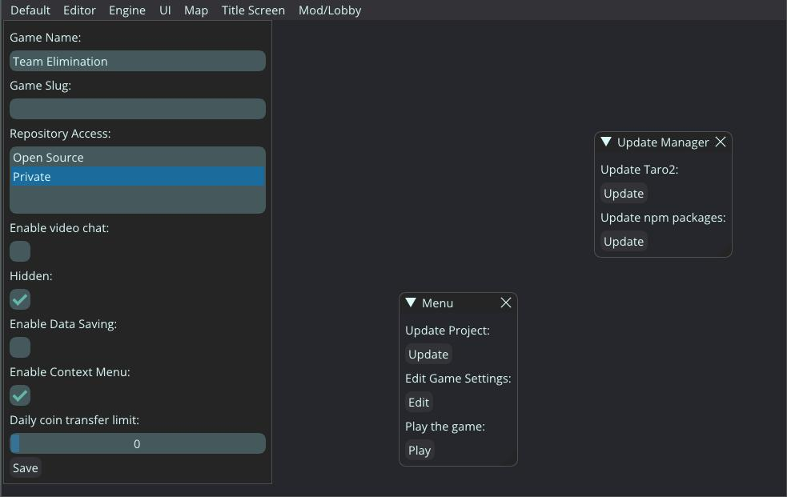

# OpenModdEditor

## cross-platform modd.io game editor
OpenModdEditor is a cross-platform game editor to create 2D multiplayer .io games.
It uses Taro2 for the backend, which makes games made with it compatible with modd.io.
## Getting OpenModdEditor
### Binary Downloads:
There are no downloadable binaries yet, as the project is still very unstable!
### Build OpenModdEditor from source:
**Build Prerequisites:**
Ensure you have Python & pip installed!

**Build steps:**
```
git clone https://github.com/Booorb/OpenModdEditor.git
```
```
cd OpenModdEditor
```
```
python -m venv <virtual-environment-name>
```
```
source /path/to/venv/bin/activate
```
```
pip install -r requirements.txt
```
```
pip src/index.py
```