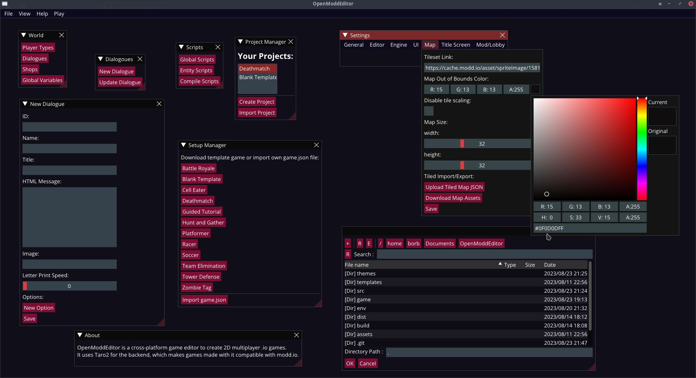

> ⚠️ OpenModdEditor is still in an early development stage. Numerous bugs and unfinished features are to be expected!
# OpenModdEditor

## Cross-platform modd.io game editor
OpenModdEditor is a cross-platform game editor to create 2D multiplayer .io games.
It uses Taro2 for the backend, which makes games made with it compatible with modd.io.
## License
OpenModdEditor is completely free and open source under the APGL License!
## Getting OpenModdEditor
### Binary Downloads:
There are no downloadable binaries yet, as the project is still very unstable!
### Build OpenModdEditor from source:
**Build Prerequisites:**
Ensure you have python, pip, git, rust and cargo installed!

**Build steps:**

***Linux:***
```
git clone https://codeberg.org/Boorb/OpenModdEditor.git
```
```
cd OpenModdEditor
```
```
python3 -m venv venv
```
```
source venv/bin/activate
```
```
pip install -r requirements.txt
```
```
pyinstaller index.spec
```
```
./dist/index/index 
```
***Windows:***
```
git clone https://codeberg.org/Boorb/OpenModdEditor.git
```
```
cd OpenModdEditor
```
```
venv\Scripts\activate
```
```
source venv/bin/activate
```
```
pip install -r requirements.txt
```
```
pyinstaller index.spec
```
```
open executable located in the dist folder
```